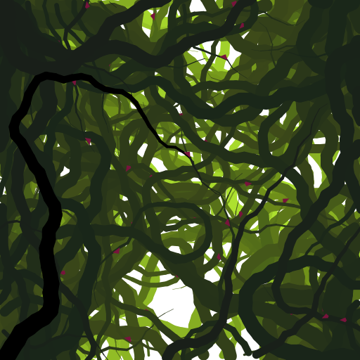

Forest
=======
A program that procedurally generates the image of a twisty, thorny bush of vines. That's pretty much it!

  
#####Sample output image from one of the runs

Instructions:
-------------
 1. Clone the Forest repo
 2. Compile src/Forest.java
 3. From commandline: **\> java Forest [animation delay] [number of vines]**
    + **[animation delay]** is in milliseconds
    + I reccomend setting **[number of vines]** to about 70
